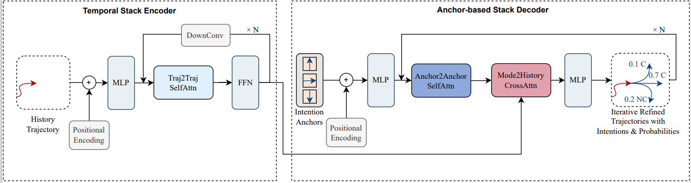

# Anchor-based Multi-modal Transformer Network for Pedestrian Trajectory and Intention Prediction
Yiwei Lin; Hu Chuan; Baixuan Zhao; Hao Jiang; Yonghang Shan; Taojun Ding; Xi Zhang*

This repo contains the code for our paper:[Anchor-based Multi-modal Transformer Network for Pedestrian Trajectory and Intention Prediction](). The paper is accepted by CVCI2023 conference.

The code is mainly based on bitrap implementation.


Our network architecture:



Usage：
1. Download the dataset from JAAD official website.
2. Clone the repo and install the requirements.
3. Change the dataset path in configs/gtppo_tr_JAAD.yml
4. Run the code:
```bash
python tools/train.py --config_file configs/gtppo_tr_JAAD.yml
# or
python tools/test.py --config_file configs/gtppo_tr_JAAD.yml --CKPT_DIR your_weights.pth
```
5. if set VISUALIZATION: True and USE_WANDB: True in configs/gtppo_tr_JAAD.yml, the results will be visualized. ffmpeg and full dataset videos are required for visualization.
```bash